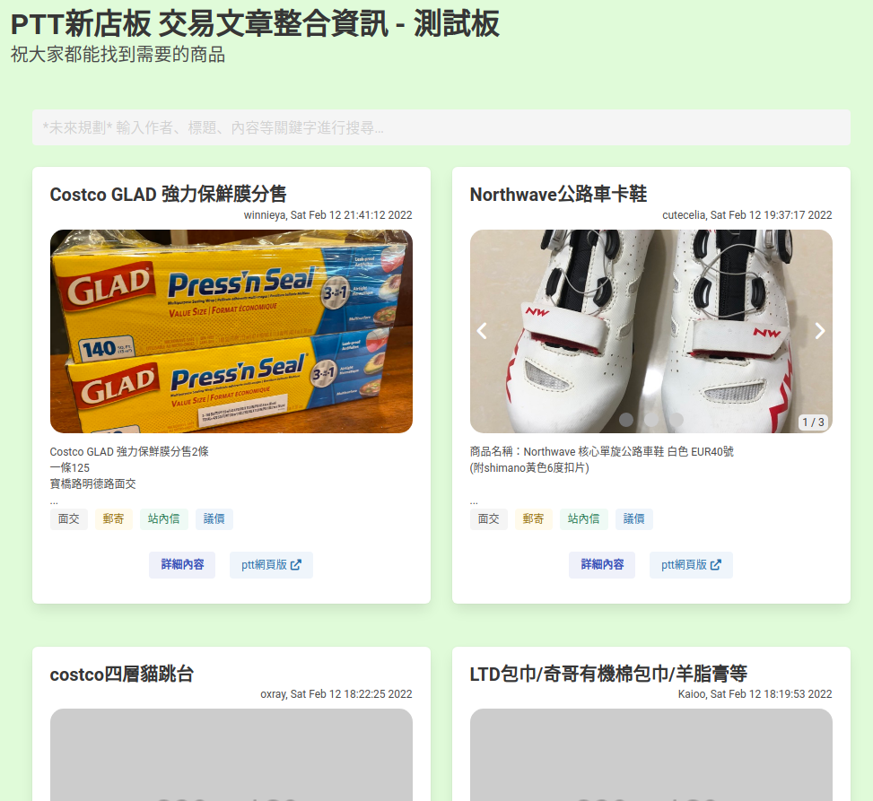

# PTTHsinTienTrade
PTT新店板交易文章備份與瀏覽平臺

# 動機
新店板上有許多交易文章，對於這些文章的去留\
板友可初步分為意見不同的兩邊\
於是，我想在板主與友們提出兩邊都滿意(或投票決定)的結果之前\
先提供一些想法與服務，\
待新店板板規調整後，再修改或新增服務以協助兩邊的板友\
來達成雙贏的局面

# 說明
這邊主要是對相關服務的程式碼做版本控制\
以記錄整個服務的開發過程\
也歡迎有興趣的朋友加入與討論

# 預計流程
1. 用PyPTT爬蟲並儲存新店板的「交易」文章相關資訊
2. 匯整後嘗試提供一個新店版近期交易文總覽的網頁服務

# 主要特色
到目前 本專案僅利用爬蟲(人工執行)後得到的結果\
進行網頁展示(測試版)，隨手寫一下目前亂開發出來的功能：
1. 響應式網頁，希望在任何裝置上都可使用(雖然在手機上還有點小問題，哭啊)
2. 文章以卡片型式表示，可掌握大概資訊(含標題、縮圖(若有)、作者、描述等)
2. 縮圖畫冊(內文含一張以上的圖片)，這…主要是我想練習w3school的教學XD
3. 「詳細內容」可跳出交易文的全部內容
4. 「ptt網頁版」則可移至ptt網頁版觀看該文章

# 問題與討論
1. 交易文標題格式勘誤，目前就不會收錄在平臺中~ (可提供給板主檢查)
2. 文章內文格式不統一，所以「面交」、「站內信」等標籤，目前是亂放的~
3. 手機上瀏覽「詳細內容」有時候會超過網頁
4. 一篇文章商品不只一種，感覺也許用使用者來分卡片也不錯，但文章格式就更重要了

# 服務平臺
網址為： https://trade.ku88.xyz \
目前以docker的型式部署在家裡的NAS上供大家使用

# 網頁截圖

# Milestones
1. 自動化(目前人工)爬新店板上文章(也與自動刪文的程式相關)
2. 文章過濾功能：可依作者、發文時間、標題等內容搜尋

# 後記
這是臨時起意的自我訓練專案，跟自動刪文政見好像沒有太大的關連QQ
不過初衷還是一樣的，一起為廣大新店板友服務吧！